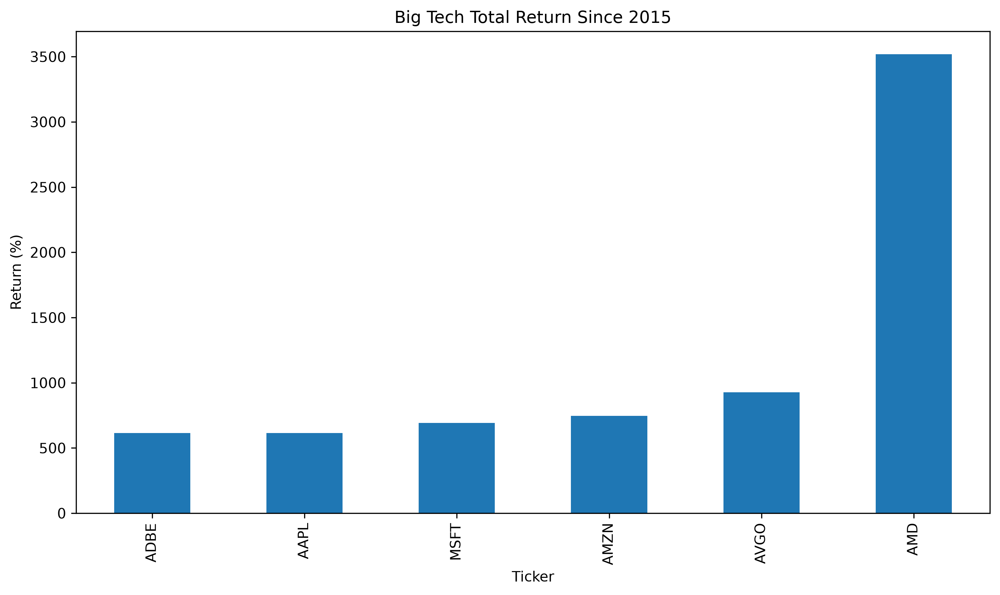
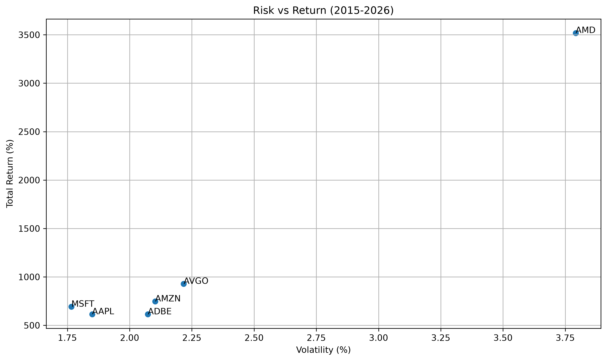

# Big Tech Stock Analysis

## Overview

This project analyzes the historical performance of major U.S. technology companies using daily stock market data from Yahoo Finance.

The analysis focuses on comparing return, risk, and risk-adjusted performance between companies over the period from 2015 onward.

The project was built to practice data analysis workflows, including data cleaning, feature engineering, financial metrics calculation, and data visualization.

---

## Companies Analyzed

- Apple (AAPL)
- Microsoft (MSFT)
- Amazon (AMZN)
- AMD (AMD)
- Broadcom (AVGO)
- Adobe (ADBE)

---

## Dataset

Historical daily stock prices obtained from Yahoo Finance.

Each company is stored as a separate CSV file containing:

- Date
- Open
- High
- Low
- Close
- Volume
- Dividends
- Stock Splits

---

## Analysis Pipeline

1. Load stock data from multiple CSV files.
2. Merge datasets into a single DataFrame.
3. Convert dates to UTC datetime format.
4. Filter observations from 2015 onward.
5. Calculate daily returns.
6. Compute performance metrics.
7. Generate visualizations.
8. Export results to CSV.

---

## Metrics

### Total Return

Measures overall growth during the analysis period.

Total Return = (Final Price − Initial Price) / Initial Price

### Volatility

Standard deviation of daily returns.

Used as a measure of risk.

### Sharpe Ratio

Measures risk-adjusted performance.

Sharpe Ratio = Mean Daily Return / Standard Deviation of Returns

Higher values indicate better return per unit of risk.

---

## Results

The project generates a summary table containing:

| Ticker | Total Return (%) | Volatility (%) | Sharpe Ratio |
|----------|----------|----------|----------|
| ... | ... | ... | ... |

Results are exported automatically to:

```text
outputs/summary.csv
```

---

## Visualizations

### Total Return Comparison



### Risk vs Return



The charts are generated automatically and saved to the `outputs` directory.

---

## Project Structure

```text
big-tech-analysis/
├── data/
│   ├── AAPL.csv
│   ├── ADBE.csv
│   ├── AMD.csv
│   ├── AMZN.csv
│   ├── AVGO.csv
│   └── MSFT.csv
│
├── outputs/
│   ├── return_chart.png
│   ├── risk_return_chart.png
│   └── summary.csv
│
├── src/
│   ├── load_data.py
│   ├── metrics.py
│   ├── visualization.py
│   └── main.py
│
├── README.md
├── requirements.txt
└── .gitignore
```

---

## Installation

Clone the repository:

```bash
git clone https://github.com/retired-snowfall/big-tech-analysis.git
cd big-tech-analysis
```

Install dependencies:

```bash
pip install -r requirements.txt
```

Run the analysis:

```bash
python src/main.py
```

---

## Technologies

- Python
- Pandas
- NumPy
- Matplotlib

---

## Future Improvements

- Maximum Drawdown analysis
- Correlation analysis between stocks
- Portfolio simulation
- Interactive dashboard using Streamlit
- Support for larger stock universes
